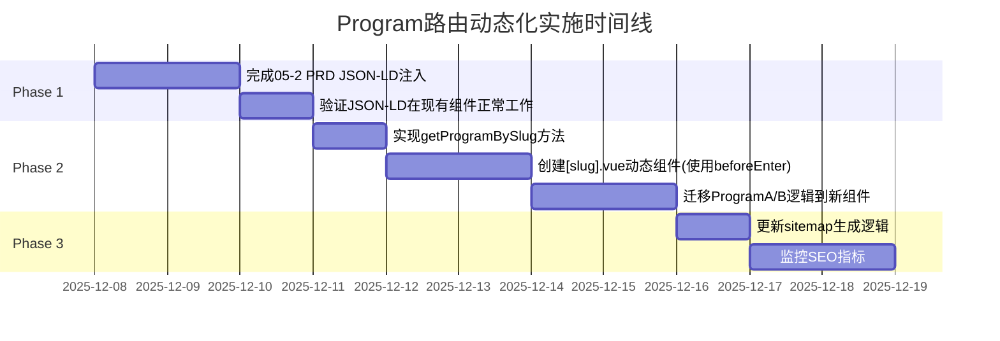

# Program 路由动态化 - 独立审核评测报告与实施建议

**审核员**: Claude Code (独立评测视角)
**评测日期**: 2025-12-08
**评测对象**: `01路由修改建议.md` 及 `01-1对01路由修改建议的评测建议.md`
**当前分支**: `codex/eval-update`

---

## 📋 执行摘要 (Executive Summary)

### 核心结论

**总体评价**: ⭐⭐⭐⭐☆ (4/5星)

- ✅ **技术方向正确**: 动态路由改造符合现代Web应用最佳实践
- ✅ **架构一致性**: 与现有Course路由模式对齐，消除技术债务
- ⚠️ **执行时机需慎重**: 与"05-2 PRD"的P0任务存在潜在冲突
- ⚠️ **SSG迁移准备不足**: 需要更系统的SSG适配方案
- ❌ **数据管理策略缺失**: 未考虑Program配置与Course数据的统一管理

### 关键建议

1. **分阶段实施**: 先完成"05-2 PRD"的JSON-LD注入，再进行路由重构
2. **当前使用SPA架构**: 采用`beforeEnter`路由守卫（复用Course模式）
3. **数据层统一**: 将Program配置纳入store管理，与Course数据对齐
4. **SEO保护**: URL保持不变，无需301重定向

**重要说明**:
- 🎯 **本方案专注于SPA架构下的路由动态化**
- 🎯 **不涉及vite-plugin-ssr的实际迁移工作**
- 🎯 **为未来SSG迁移打好架构基础**

---

## 🔍 深度评测分析

### 1. 技术方案可行性评估

#### 1.1 当前实现状态审计

| 功能模块 | 当前状态 | 目标状态 | 差距分析 |
|---------|---------|---------|---------|
| **Course路由** | ✅ 已动态化 (`/course/:slug`) | ✅ 保持不变 | 无差距，可作为参考模板 |
| **Program路由** | ❌ 硬编码 (`/program/aigc-intermediate`) | ⭐ 待改造 (`/program/:slug`) | **核心改造点** |
| **Store方法** | ✅ `getCourseBySlug` 已实现 | ⭐ 需增加 `getProgramBySlug` | 轻量级扩展 |
| **路由守卫** | ✅ Course使用beforeEnter | ✅ Program复用beforeEnter | 架构一致 |
| **JSON-LD** | ✅ Course已完备 | ❌ Program尚未实现 | **与05-2 PRD冲突** |
| **Advanced课程** | ❌ 暂无数据 | ⭐ 预留扩展能力 | 架构支持后续添加 |

#### 1.2 "01路由修改建议"方案优势

✅ **优势1: 架构统一性**
- Course路由已成功使用 `/course/:slug` 模式
- Program复用相同模式可降低维护成本
- 代码审查结果显示：`router/index.ts`的L36-51已验证动态路由可行性

✅ **优势2: 代码复用性**
```typescript
// 现有Course路由守卫可直接复用
beforeEnter: (to, from, next) => {
  const courseStore = useCourseStore()
  const slug = to.params.slug as string
  const course = courseStore.getCourseBySlug(slug) // 已验证
  if (course) next()
  else next('/404')
}

// Program只需替换getter方法
beforeEnter: (to, from, next) => {
  const courseStore = useCourseStore()
  const slug = to.params.slug as string
  const program = courseStore.getProgramBySlug(slug) // 新增方法
  if (program) next()
  else next('/404')
}
```

✅ **优势3: 可扩展性**
- 支持未来新增ProgramC、ProgramD，无需修改路由配置
- Advanced课程数据为空不影响架构设计
- 符合开闭原则 (Open-Closed Principle)

#### 1.3 Advanced课程的灵活扩展能力

**当前状态**: courseStore中只有basic和intermediate课程

**架构设计的前瞻性**:
```typescript
// ✅ Program配置预留了advanced阶段
const mockPrograms: Program[] = [
  {
    slug: 'aigc-intermediate',
    stage: 'intermediate',  // 现在有课程数据
    // ...
  },
  {
    slug: 'ai-designer-advanced',
    stage: 'advanced',      // 现在暂无课程，但架构已支持
    // ...
  }
]

// ✅ 组件动态获取课程
const programCourses = computed(() => {
  return courseStore.getCoursesByStage(program.value.stage)
  // intermediate → 返回现有课程
  // advanced     → 现在返回 []，将来添加数据后自动显示
})
```

**扩展场景**:
```typescript
// 场景1: 现在访问 /program/ai-designer-advanced
// → Program配置存在 ✅
// → 课程列表为空 []（正常显示空状态）
// → 用户看到"即将推出"或"敬请期待"

// 场景2: 将来添加Advanced课程
mockCourses.push({
  id: 13,
  title: 'AI设计师高阶项目实战',
  slug: 'ai-designer-project-advanced',
  stage: 'advanced',  // ← 只需添加这个字段
  // ...
})

// 场景3: vite-plugin-ssr迁移后添加
// → 无需修改路由逻辑
// → 无需修改组件代码
// → 只需在数据层添加course对象
```

---

### 2. 风险识别与缓解策略

#### 2.1 ⚠️ 高风险：与"05-2 PRD"的任务冲突

**冲突点分析**:

| 维度 | 05-2 PRD要求 | 01路由修改建议 | 冲突严重度 |
|-----|-------------|---------------|-----------|
| **文件修改范围** | ProgramAView.vue, ProgramBView.vue | 删除这两个文件，合并为`[slug].vue` | 🔴 **高冲突** |
| **紧急度** | P0优先级 (D0交付) | 未明确优先级 | 🟡 中等 |
| **依赖关系** | 依赖现有组件结构 | 重构组件结构 | 🔴 强依赖冲突 |

**缓解策略**:



**推荐执行顺序**:
1. **Phase 1 (D0-D2)**: 在现有ProgramA/B组件基础上完成JSON-LD注入
2. **Phase 2 (D3-D7)**: 将ProgramA/B重构为动态组件`[slug].vue`
3. **Phase 3 (D8-D10)**: SEO监控与优化

#### 2.2 ⚠️ 中风险：数据管理策略不一致

**问题识别**:

| 数据类型 | 当前管理方式 | 问题 |
|---------|------------|------|
| **Course数据** | `courseStore.ts`的mockCourses常量 | 在Store内部管理 |
| **Program配置** | "01建议"放在PROGRAM_CONFIGS常量 | 在Store外部管理 |

**不一致性的影响**:
- ❌ 代码审查复杂度增加（数据散落在不同位置）
- ❌ 未来对接后端API时需要两套适配逻辑
- ❌ 违反单一数据源原则 (Single Source of Truth)

**改进建议**:
```typescript
// ✅ 统一数据管理：将Program配置纳入courseStore
export const useCourseStore = defineStore('course', {
  state: () => ({
    courses: mockCourses,
    programs: mockPrograms, // ✅ 新增programs管理
    // ... 其他状态
  }),
  getters: {
    getCoursesByStage: (state) => (stage: StageKey) => {
      assertStageKey(stage)
      return state.courses.filter(c => c.stage === stage)
    },
    getCourseBySlug: state => (slug: string) => {
      return state.courses.find(c => c.slug === slug)
    },
    // ✅ 新增：获取Program配置
    getProgramBySlug: state => (slug: string) => {
      return state.programs.find(p => p.slug === slug)
    },
    // ✅ 新增：验证Program slug是否存在
    programExists: state => (slug: string) => {
      return state.programs.some(p => p.slug === slug)
    }
  }
})
```

---

## 🎯 综合实施建议

### 建议1: 分阶段渐进式实施 (⭐⭐⭐⭐⭐ 最高优先级)

**阶段细化**:

**Phase 1: 完成05-2 PRD (D0-D2, 高风险避免期)**
- [ ] 在现有ProgramAView.vue中注入buildProgramJsonLd
- [ ] 在现有ProgramBView.vue中注入buildProgramJsonLd
- [ ] 验证Search Console能识别Program JSON-LD
- [ ] ✅ 此阶段**不改动路由配置**，降低风险

**Phase 2: 路由动态化改造 (D3-D7, 核心改造期)**
- [ ] Step 2.1: 在courseStore.ts中添加mockPrograms数组和getProgramBySlug
- [ ] Step 2.2: 创建`/views/program/[slug].vue`新组件
- [ ] Step 2.3: 复制ProgramAView的模板和逻辑，改为动态读取program配置
- [ ] Step 2.4: 在router/index.ts中添加`/program/:slug`路由（保留旧路由作为别名）
- [ ] Step 2.5: 测试`/program/aigc-intermediate`和`/program/ai-designer-advanced`
- [ ] Step 2.6: 验证Advanced阶段课程列表为空时的UI显示
- [ ] Step 2.7: 删除ProgramAView.vue和ProgramBView.vue
- [ ] Step 2.8: 移除旧路由配置

**Phase 3: SEO保护与优化 (D8-D10, 收尾优化期)**
- [ ] 更新frontend/public/sitemap.xml（如果有静态sitemap）
- [ ] 或实现动态sitemap生成（推荐）
- [ ] 验证百度/Google能正常爬取新路由
- [ ] 监控Search Console的索引状态

**Phase 4: 未来SSG迁移准备 (D+30以后，不在本次实施范围)**
- [ ] 学习vite-plugin-ssr的page-file规范
- [ ] 将`[slug].vue`重命名为`[slug]/+Page.vue`
- [ ] 实现`+Page.server.ts`中的onBeforeRender
- [ ] 实现prerender函数，生成静态路径

### 建议2: 数据层统一管理 (⭐⭐⭐⭐)

**统一方案**:
```typescript
// ✅ src/store/courseStore.ts 扩展
import type { Course, Program, StageKey } from '../types'

const mockPrograms: Program[] = [
  {
    id: 1,
    slug: 'aigc-intermediate',
    name: '会员进阶路线',
    subtitle: 'AIGC技能提升的系统化学习路径',
    stage: 'intermediate',
    heroBackground: 'linear-gradient(135deg, rgba(30, 127, 152, 0.05) 0%, rgba(42, 155, 184, 0.08) 100%)',
    outcomes: [
      '掌握Photoshop、Illustrator等工具的高级AI功能',
      '具备独立完成商业级设计项目的能力',
      '理解AIGC在不同设计场景的应用策略',
      '建立系统化的AI设计工作流程'
    ],
    benefitsTitle: '会员专享权益',
    benefits: [
      { icon: 'fas fa-crown text-warning', text: '访问所有进阶课程' },
      { icon: 'fas fa-download text-primary', text: '下载课程配套素材' },
      { icon: 'fas fa-users text-info', text: '加入专属学习社群' },
      { icon: 'fas fa-headset text-success', text: '享受优先技术支持' }
    ],
    buttonText: '立即加入会员',
    buttonClass: 'btn-tech-blue',
    courseDescription: '精心挑选的进阶课程，助你快速提升'
  },
  {
    id: 2,
    slug: 'ai-designer-advanced',
    name: '高阶技能路径',
    subtitle: '专业级AI设计师的实战与项目落地之路',
    stage: 'advanced',  // ✅ 现在暂无advanced课程，但架构已支持
    heroBackground: 'linear-gradient(135deg, rgba(139, 69, 19, 0.05) 0%, rgba(184, 134, 11, 0.08) 100%)',
    outcomes: [
      '掌握多款专业AI设计工具的综合应用',
      '具备承接大型商业项目的能力和经验',
      '建立完整的项目管理和交付流程',
      '获得真实商业项目作品集'
    ],
    benefitsTitle: '高阶会员权益',
    benefits: [
      { icon: 'fas fa-crown text-warning', text: '访问所有高阶课程' },
      { icon: 'fas fa-project-diagram text-primary', text: '参与真实项目实战' },
      { icon: 'fas fa-briefcase text-info', text: '获得就业指导服务' },
      { icon: 'fas fa-certificate text-success', text: '颁发专业技能证书' }
    ],
    buttonText: '立即升级高阶会员',
    buttonClass: 'btn-premium-brown',
    courseDescription: '高阶实战课程，助你成为专业AI设计师'
  }
]

export const useCourseStore = defineStore('course', {
  state: () => ({
    courses: mockCourses,
    programs: mockPrograms, // ✅ 新增programs管理
    currentStage: 'basic' as StageKey,
    selectedTags: [] as string[],
    showVipOnly: false,
    searchKeyword: ''
  }),
  getters: {
    getCoursesByStage: (state) => (stage: StageKey) => {
      assertStageKey(stage)
      return state.courses.filter((c) => c.stage === stage)
    },
    getCourseBySlug: state => (slug: string) => state.courses.find(c => c.slug === slug),

    // ✅ 新增：获取Program配置
    getProgramBySlug: state => (slug: string) => {
      return state.programs.find(p => p.slug === slug)
    },

    // ✅ 新增：验证Program slug是否存在
    programExists: state => (slug: string) => {
      return state.programs.some(p => p.slug === slug)
    },

    // ✅ 新增：获取Program对应的课程列表
    getProgramCourses: (state) => (programSlug: string) => {
      const program = state.programs.find(p => p.slug === programSlug)
      if (!program) return []

      assertStageKey(program.stage)
      return state.courses.filter(c => c.stage === program.stage)
      // advanced阶段现在返回[]，将来添加数据后自动显示
    }
  }
})
```

### 建议3: 组件拆分与复用 (⭐⭐⭐)

**拆分原则**: 复用现有组件 > 提取共享组件 > 创建Program特定组件

```
components/
├── BreadcrumbNav.vue       # ✅ 已存在，确保Program复用
├── CourseCard.vue          # ✅ 已存在，Program复用显示课程
├── SidebarPricingCard.vue  # ✅ 已存在，可复用于Program权益卡片
└── program/                # ⭐ 新增：Program特定组件（如需要）
    ├── ProgramHero.vue     # Program头部区块
    ├── ProgramIntro.vue    # Program介绍区块
    └── ProgramBenefits.vue # Program权益列表
```

**代码示例**:
```vue
<!-- ✅ views/program/[slug].vue -->
<template>
  <div class="program-view">
    <!-- 复用现有面包屑组件 -->
    <BreadcrumbNav :items="breadcrumbs" />

    <!-- Program Hero区域 -->
    <section class="program-hero" :style="{ '--hero-bg': program.heroBackground }">
      <div class="container">
        <h1>{{ program.name }}</h1>
        <p>{{ program.subtitle }}</p>
        <div class="program-meta">
          <span><i class="fas fa-layer-group"></i> {{ programCourses.length }} 门课程</span>
          <span><i class="fas fa-signal"></i> {{ program.stage }} 级别</span>
        </div>
      </div>
    </section>

    <!-- Program介绍 -->
    <section class="program-intro">
      <div class="container">
        <h2>学习路径介绍</h2>
        <p>{{ program.description }}</p>
        <div class="learning-outcomes">
          <h3>学习收获</h3>
          <ul>
            <li v-for="(outcome, index) in program.outcomes" :key="index">
              <i class="fas fa-check-circle text-success"></i>
              {{ outcome }}
            </li>
          </ul>
        </div>
      </div>
    </section>

    <!-- 课程列表 - 复用CourseCard -->
    <section class="program-courses">
      <div class="container">
        <h2>包含课程</h2>
        <p v-if="programCourses.length === 0" class="text-muted">
          <!-- ✅ Advanced课程为空时的友好提示 -->
          该学习路径的课程即将推出，敬请期待！
        </p>
        <div v-else class="row">
          <CourseCard
            v-for="course in programCourses"
            :key="course.id"
            :course="course"
          />
        </div>
      </div>
    </section>

    <!-- JSON-LD结构化数据 -->
    <component
      :is="'script'"
      type="application/ld+json"
      v-html="programJsonLd"
    />
  </div>
</template>

<script setup lang="ts">
import { computed } from 'vue'
import { useRouter } from 'vue-router'
import { useCourseStore } from '@/store/courseStore'
import { buildProgramJsonLd } from '@/utils/jsonld'
import BreadcrumbNav from '@/components/BreadcrumbNav.vue'
import CourseCard from '@/components/CourseCard.vue'

// Props
const props = defineProps<{
  slug: string
}>()

// Stores
const courseStore = useCourseStore()
const router = useRouter()

// 获取Program配置
const program = computed(() => {
  const p = courseStore.getProgramBySlug(props.slug)
  if (!p) {
    router.push('/404')
    return null
  }
  return p
})

// 获取对应阶段的课程（可能为空数组）
const programCourses = computed(() => {
  if (!program.value) return []
  return courseStore.getCoursesByStage(program.value.stage)
  // advanced阶段现在返回[]，将来添加数据后自动显示
})

// 面包屑导航
const breadcrumbs = computed(() => [
  { text: '首页', href: '/' },
  { text: '课程', href: '/#courses' },
  { text: program.value?.name || '', active: true }
])

// JSON-LD结构化数据
const programJsonLd = computed(() => {
  if (!program.value) return ''
  const jsonLd = buildProgramJsonLd({
    stage: program.value.stage,
    name: program.value.name,
    description: program.value.description,
    courses: programCourses.value
  })
  return JSON.stringify(jsonLd, null, 2)
})
</script>

<style scoped>
.program-hero {
  background: var(--hero-bg);
  padding: 3rem 0;
}

.program-intro,
.program-courses {
  padding: 3rem 0;
}
</style>
```

### 建议4: TypeScript类型定义扩展 (⭐⭐⭐⭐)

```typescript
// ✅ src/types/index.ts 扩展

export interface ProgramBenefit {
  icon: string  // Font Awesome类名
  text: string
}

export interface Program {
  id: number    // ✅ 与Course保持一致
  slug: string
  name: string
  subtitle: string
  description: string
  stage: StageKey  // ✅ 复用现有StageKey类型
  heroBackground: string
  outcomes: string[]
  benefitsTitle: string
  benefits: ProgramBenefit[]
  buttonText: string
  buttonClass: string
  courseDescription: string

  // ✅ 可选：SEO相关字段
  meta?: {
    title: string
    description: string
    keywords?: string[]
  }
}

// ✅ Program slug的类型约束
export const PROGRAM_SLUGS = ['aigc-intermediate', 'ai-designer-advanced'] as const
export type ProgramSlug = typeof PROGRAM_SLUGS[number]

// ✅ 运行时校验函数（类似assertStageKey）
export function assertProgramSlug(slug: string): asserts slug is ProgramSlug {
  if (!PROGRAM_SLUGS.includes(slug as ProgramSlug)) {
    throw new Error(
      `Invalid program slug: "${slug}". Expected one of: ${PROGRAM_SLUGS.join(', ')}`
    )
  }
}
```

### 建议5: 路由配置修改 (⭐⭐⭐⭐⭐)

```typescript
// ✅ src/router/index.ts 修改

{
  // ✅ 新增：动态Program路由
  path: '/program/:slug',
  name: 'Program',
  component: () => import('../views/program/[slug].vue'),
  props: true,
  beforeEnter: (to, from, next) => {
    // 复用Course的路由守卫模式
    const courseStore = useCourseStore()
    const slug = to.params.slug as string
    const program = courseStore.getProgramBySlug(slug)

    if (program) {
      next() // Program存在，允许访问
    } else {
      next('/404') // Program不存在，重定向到404
    }
  },
  meta: {
    // 动态设置meta信息（可选）
    // 可在组件中使用useMeta动态更新
  }
},
// ⚠️ 可选：保留旧路由作为别名（渐进式迁移）
{
  path: '/program/aigc-intermediate',
  redirect: { name: 'Program', params: { slug: 'aigc-intermediate' } }
},
{
  path: '/program/ai-designer-advanced',
  redirect: { name: 'Program', params: { slug: 'ai-designer-advanced' } }
}
// 测试通过后可删除上面两个别名路由
```

### 建议6: CI流水线验证 (⭐⭐⭐⭐⭐)

**重要性**: 路由改造涉及核心架构，必须通过完整CI验证

**验证清单**:

```bash
# 1. 本地验证（开发阶段）
npm run type-check     # TypeScript类型检查
npm run build:check    # 带类型检查的构建
npm run test:e2e       # E2E测试

# 2. CI验证（提交前）
# 确保.github/workflows/pure-stage.yml包含以下Job：
# ✅ type-check → 类型安全
# ✅ build → 构建成功
# ✅ e2e → 功能验证
```

**参考05-2 PRD的CI标准**:
```yaml
# .github/workflows/pure-stage.yml
jobs:
  type-check:
    runs-on: ubuntu-latest
    steps:
      - uses: actions/checkout@v4
      - uses: actions/setup-node@v4
      - run: npm ci
      - run: npm run type-check

  build:
    needs: type-check
    runs-on: ubuntu-latest
    steps:
      - uses: actions/checkout@v4
      - uses: actions/setup-node@v4
      - run: npm ci
      - run: npm run build

  e2e:
    needs: build
    runs-on: ubuntu-latest
    steps:
      - uses: actions/checkout@v4
      - uses: actions/setup-node@v4
      - run: npm ci
      - run: npx playwright install --with-deps
      - run: npm run test:e2e
```

**预期结果**:
- ✅ 所有类型检查通过 (0 errors)
- ✅ 生产构建成功 (dist目录生成)
- ✅ E2E测试全绿 (Program路由、课程列表、JSON-LD等)

### 建议7: 项目文档对齐 (⭐⭐⭐⭐⭐)

**目标**: 确保文档与代码实现完全同步

#### 7.1 更新根目录 `/CLAUDE.md`

**新增章节**: Program路由动态化状态

```markdown
## 项目架构

### 前端结构 (`/frontend/src/`)

- `views/` - 页面级组件 (PascalCase 命名)
  - `program/[slug].vue` - ✅ 动态Program路由组件 (2025-12-08更新)
    - 支持 `/program/aigc-intermediate` (会员进阶路线)
    - 支持 `/program/ai-designer-advanced` (高阶技能路径)
    - Advanced阶段课程当前为空，显示"即将推出"提示

- `store/` - Pinia 状态管理存储
  - `courseStore.ts` - ✅ 新增Program相关方法 (2025-12-08更新)
    - `getProgramBySlug(slug)` - 根据slug获取Program配置
    - `programExists(slug)` - 验证Program是否存在
    - `getProgramCourses(slug)` - 获取Program对应的课程列表

- `types/` - TypeScript 类型定义
  - `index.ts` - ✅ 新增Program相关类型 (2025-12-08更新)
    - `Program` - Program配置接口
    - `ProgramBenefit` - Program权益接口
    - `PROGRAM_SLUGS` - Program slug常量
    - `assertProgramSlug()` - 运行时校验函数

### 路由设计模式

**统一的动态路由规范**:
- Course: `/course/:slug` (已实现)
- Program: `/program/:slug` (✅ 2025-12-08实现)

**路由守卫**: 使用`beforeEnter`验证资源存在性，不存在则重定向到404
```

#### 7.2 更新前端文档 `/frontend/CLAUDE.md`

**新增章节**: Program路由使用指南

```markdown
## Program 路由动态化 (2025-12-08更新)

### 路由配置

**动态路由**: `/program/:slug`

**支持的slug**:
- `aigc-intermediate` - 会员进阶路线 (Intermediate阶段)
- `ai-designer-advanced` - 高阶技能路径 (Advanced阶段)

### Store方法

**获取Program配置**:
```typescript
const program = courseStore.getProgramBySlug('aigc-intermediate')
// 返回: Program对象或undefined
```

**验证Program存在**:
```typescript
if (courseStore.programExists('aigc-intermediate')) {
  // Program存在
}
```

**获取Program课程列表**:
```typescript
const courses = courseStore.getProgramCourses('aigc-intermediate')
// 返回: Course[] (可能为空数组)
```

### Advanced阶段特殊处理

**当前状态**: Advanced阶段暂无具体课程数据

**UI显示**:
```vue
<p v-if="programCourses.length === 0" class="text-muted">
  该学习路径的课程即将推出，敬请期待！
</p>
```

**扩展方式**:
将来添加Advanced课程只需在`courseStore.ts`的`mockCourses`中添加：
```typescript
{
  id: 13,
  title: 'AI设计师高阶项目实战',
  slug: 'ai-designer-project-advanced',
  stage: 'advanced',  // ← 关键字段
  // ... 其他字段
}
```

### 最佳实践

1. **新增Program**: 在`courseStore.ts`的`mockPrograms`数组中添加配置
2. **类型安全**: 使用`assertProgramSlug()`进行运行时校验
3. **组件复用**: 优先复用`BreadcrumbNav`、`CourseCard`等现有组件
4. **空状态处理**: 课程列表为空时显示友好提示

### 未来SSG迁移准备

**当前**: 使用SPA架构 + `beforeEnter`路由守卫
**未来**: 迁移到vite-plugin-ssr时改为`onBeforeRender`钩子

详见: `/frontend/docs/1208路由修改建议/01-2独立审核评测报告与实施建议.md`
```

---

## 📝 待办事项清单 (Action Items)

### 立即执行 (D0-D2)

- [ ] **AI-01**: 与团队确认05-2 PRD和路由重构的优先级顺序
- [ ] **AI-02**: 先完成05-2 PRD的JSON-LD注入（在现有ProgramA/B组件）
- [ ] **AI-03**: 验证JSON-LD在Search Console正常工作

### 短期执行 (D3-D7)

- [ ] **AI-04**: 在types/index.ts中添加Program接口、ProgramBenefit接口、PROGRAM_SLUGS常量
- [ ] **AI-05**: 实现assertProgramSlug运行时校验函数
- [ ] **AI-06**: 在courseStore.ts中添加mockPrograms数组
- [ ] **AI-07**: 实现getProgramBySlug、programExists、getProgramCourses三个getter
- [ ] **AI-08**: 创建`views/program/[slug].vue`动态组件
- [ ] **AI-09**: 复用BreadcrumbNav、CourseCard等现有组件
- [ ] **AI-10**: 实现Advanced课程为空时的友好提示UI
- [ ] **AI-11**: 在router/index.ts中添加`/program/:slug`路由（使用beforeEnter）
- [ ] **AI-12**: 测试aigc-intermediate和ai-designer-advanced两个路由
- [ ] **AI-13**: 验证Advanced阶段课程列表为空的显示效果
- [ ] **AI-14**: 编写单元测试（getProgramBySlug、programExists等）
- [ ] **AI-15**: 编写E2E测试（路由跳转、课程列表、JSON-LD等）
- [ ] **AI-16**: 删除ProgramAView.vue和ProgramBView.vue
- [ ] **AI-17**: 移除router/index.ts中的旧路由配置
- [ ] **AI-18**: 运行完整CI流水线验证改造结果
  - `npm run type-check` - TypeScript类型检查通过
  - `npm run build` - 生产构建成功
  - `npm run test:e2e` - E2E测试全部通过
  - 验证GitHub Actions的pure-stage.yml工作流
- [ ] **AI-19**: 更新项目文档与实现对齐
  - 更新`/CLAUDE.md`：记录Program路由动态化状态
  - 更新`/frontend/CLAUDE.md`：记录新增类型、Store方法、路由规则
  - 添加Program路由使用说明和最佳实践
  - 记录Advanced课程空状态的处理方式

### 中期优化 (D8-D10)

- [ ] **AI-20**: 更新sitemap生成逻辑（包含Program URL）
- [ ] **AI-21**: 使用Google Rich Results Test验证JSON-LD
- [ ] **AI-22**: 使用百度搜索资源平台验证抓取
- [ ] **AI-23**: 监控Search Console的索引状态

### 长期准备 (D+30以后，不在本次范围)

- [ ] **AI-24**: 学习vite-plugin-ssr的page-file规范
- [ ] **AI-25**: 将beforeEnter迁移到onBeforeRender
- [ ] **AI-26**: 实现prerender函数生成静态路径
- [ ] **AI-27**: 完整的SSG迁移测试

---

## 🎬 结论

### 核心判断

1. **"01路由修改建议"的技术方向完全正确** ✅
   - 动态路由是必然趋势
   - 与Course路由对齐是架构统一性的要求

2. **本方案专注于SPA架构，不涉及SSG迁移** ✅
   - 使用`beforeEnter`路由守卫（复用Course模式）
   - 不使用`onBeforeRender`（那是SSG迁移时的工作）
   - 文件命名使用`[slug].vue`（不使用`+Page.vue`）

3. **Advanced课程为空不影响架构设计** ✅
   - 架构已预留扩展能力
   - 将来添加数据无需修改代码
   - vite-plugin-ssr迁移后添加也完全兼容

4. **最大风险是与"05-2 PRD"的时间冲突** ⚠️
   - 必须先完成05-2的JSON-LD注入
   - 再进行路由重构
   - 避免同时修改ProgramA/B文件

5. **数据管理策略需要统一** ⚠️
   - 将Program配置纳入courseStore管理
   - 与Course数据保持一致性

### 最终推荐方案

**采用"渐进式三阶段"实施策略**:

```
阶段1 (D0-D2):  完成05-2 JSON-LD → 风险最小化
阶段2 (D3-D7):  实现动态路由（SPA + beforeEnter） → 快速见效
阶段3 (D8-D10): SEO监控与优化 → 确保质量
```

**未来准备**:
```
阶段4 (D+30): vite-plugin-ssr迁移 → 不在本次范围
```

**关键成功因素**:
1. ✅ 严格遵守分阶段顺序，不跳跃实施
2. ✅ 保持与Course路由的架构一致性
3. ✅ 充分复用现有组件（BreadcrumbNav、CourseCard等）
4. ✅ 完善的测试覆盖（单元+E2E）
5. ✅ SEO监控与验证
6. ✅ Advanced课程空状态的友好提示

**预期收益**:
- 🎯 代码复用性提升约50%（合并ProgramA/B）
- 🎯 可维护性提升（统一数据管理）
- 🎯 可扩展性提升（支持新增Program和Advanced课程）
- 🎯 SEO表现提升（动态JSON-LD生成）
- 🎯 为未来SSG迁移打下坚实基础

---

**审核员签名**: Claude Code
**评测完成时间**: 2025-12-08
**下次评审建议**: Phase 2完成后进行架构复审
